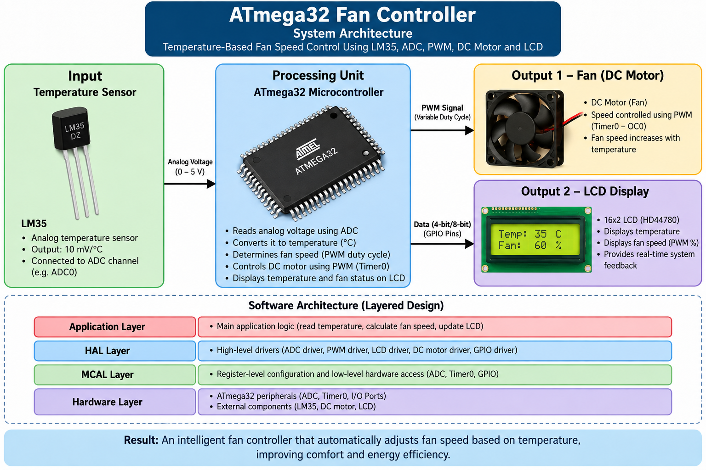

# ATmega32 Fan Controller

An embedded fan control system based on the ATmega32 microcontroller. The system measures temperature using an LM35 sensor, processes the analog signal through the ADC, and automatically controls DC fan speed using PWM.

## System Architecture

## Features

- Temperature measurement using LM35
- ADC-based temperature sensing
- Automatic fan speed control
- PWM-based DC motor control
- Timer0 PWM generation
- Real-time temperature display on 16x2 LCD
- Modular driver-based software architecture
- Layered embedded software design

## System Operation

The LM35 temperature sensor continuously measures the surrounding temperature.

1. The LM35 generates an analog voltage proportional to temperature.
2. The ATmega32 ADC converts the analog signal into a digital value.
3. The measured value is converted into temperature in Celsius.
4. The application determines the required fan speed based on the temperature.
5. PWM is generated using Timer0 to control the DC motor.
6. The LCD displays the current temperature and fan status.

## Hardware

- ATmega32 Microcontroller
- LM35 Temperature Sensor
- DC Motor / Fan
- 16x2 LCD
- PWM Timer0
- ADC

## Software Architecture

    +--------------------------------------+
    |          Application Layer           |
    |  Temperature Processing & Fan Logic  |
    +--------------------------------------+
    |              HAL Layer               |
    | LM35 | DC Motor | LCD | PWM | ADC    |
    +--------------------------------------+
    |              MCAL Layer              |
    |        GPIO | ADC | Timer0           |
    +--------------------------------------+
    |            ATmega32 MCU              |
    +--------------------------------------+

The project separates application logic from hardware drivers to provide a modular and reusable embedded software structure.

## Drivers

### MCAL

- GPIO
- ADC
- Timer0 / PWM

### HAL

- LM35 Temperature Sensor
- DC Motor
- LCD

## Project Structure

    ATmega32-Fan-Controller/
    │
    ├── README.md
    ├── ATmega32-Fan-Controller-Architecture.png
    │
    └── Source/
        ├── adc.c
        ├── adc_interface.h
        ├── adc_private.h
        ├── common_macros.h
        ├── dc_motor.c
        ├── dc_motor.h
        ├── gpio.c
        ├── gpio_interface.h
        ├── gpio_private.h
        ├── Internal_mapping_register_private.h
        ├── lcd.c
        ├── lcd.h
        ├── lm35_sensor.c
        ├── lm35_sensor.h
        ├── main.c
        ├── pwm_timer0.c
        ├── pwm_timer0.h
        ├── pwm_timer0_private.h
        └── std_types.h

## Technologies & Concepts

- Embedded C
- ATmega32
- ADC
- LM35 Temperature Sensor
- PWM
- Timer0
- DC Motor Control
- GPIO
- LCD Interfacing
- Modular Driver Architecture
- Hardware Abstraction
- Layered Architecture

## Key Embedded Concepts Demonstrated

- Reading analog sensor data using ADC
- Converting ADC readings into temperature values
- Generating PWM signals using Timer0
- Controlling motor speed through PWM
- Interfacing an LCD with an ATmega32
- Developing reusable peripheral drivers
- Separating application and driver layers

## Project Specifications

- Microcontroller: ATmega32
- Temperature Sensor: LM35
- Fan Actuator: DC Motor
- Display: 16x2 LCD
- ADC: ATmega32 ADC
- PWM: Timer0
- Programming Language: Embedded C

## Author

**Adham Muhammed**

Embedded SW Engineer

## Project Type

Educational Embedded Systems Project demonstrating temperature sensing, ADC interfacing, PWM-based motor control, LCD interfacing, and modular embedded software architecture.
